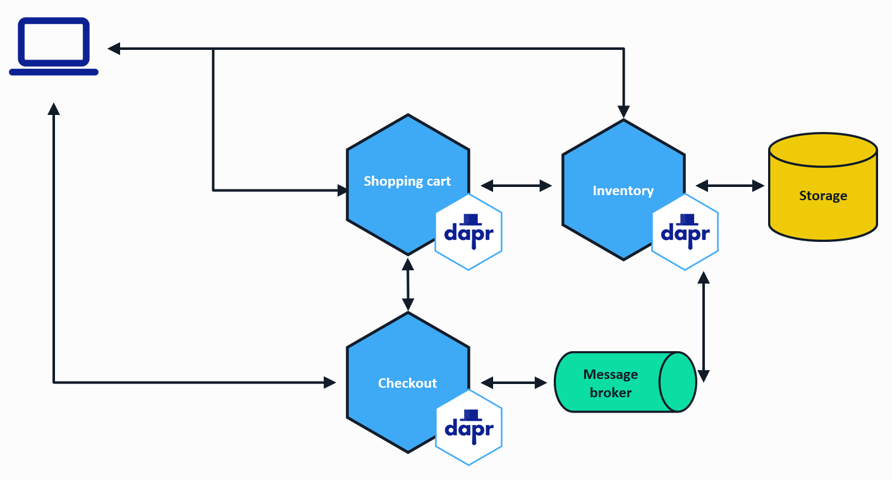
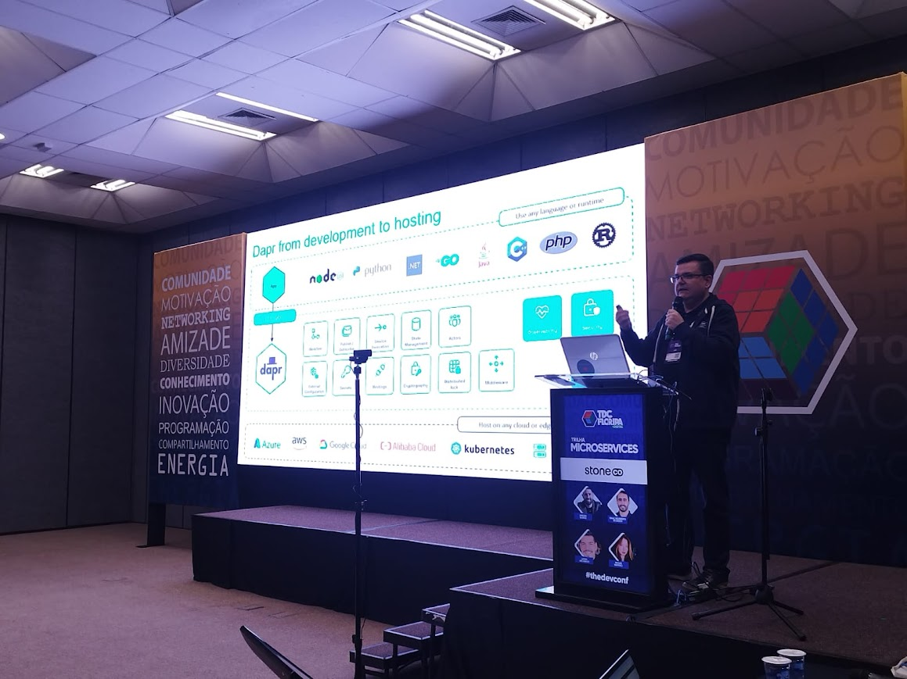
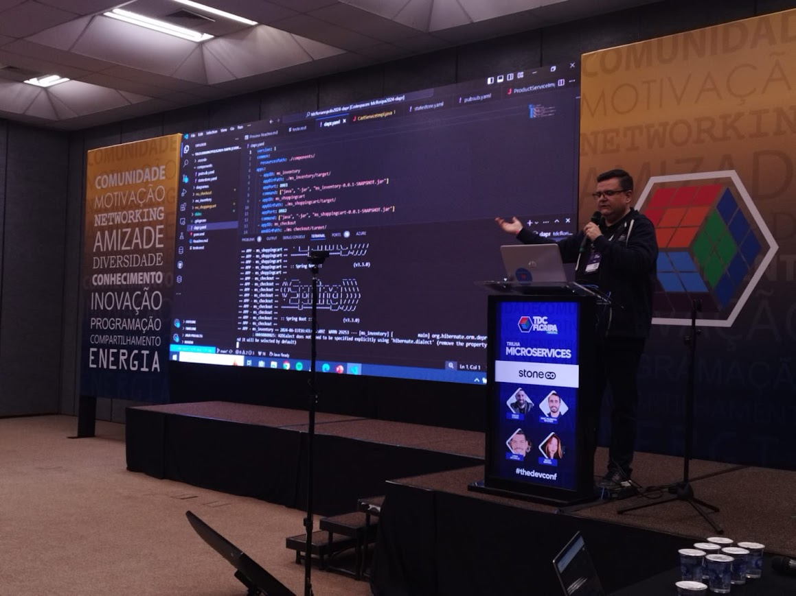
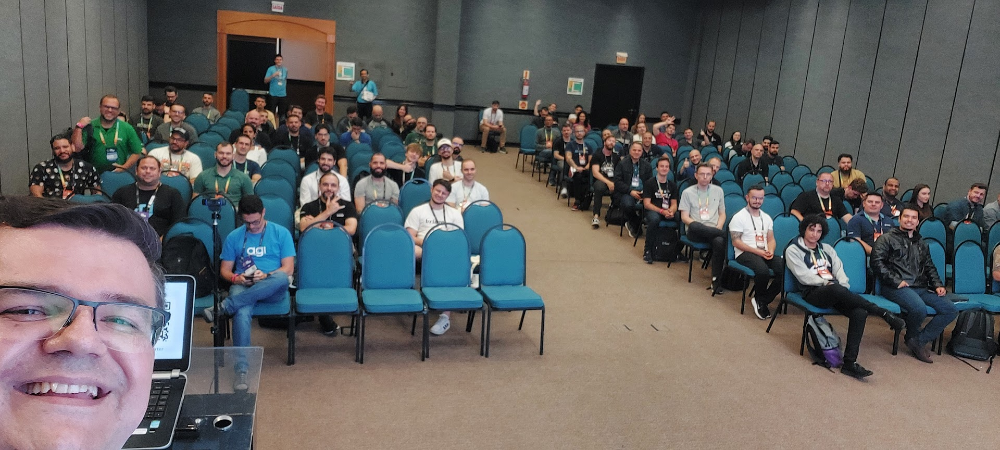

# TDC Florianópolis 2024 - Dapr
## 13/06 - Florianópolis / SC

## Como o Dapr (Distributed Application Runtime) pode simplificar o desenvolvimento de aplicações em microservices

### Tecnologias
[](https://skillicons.dev)

## Site Dapr.io
- [https://dapr.io/](https://dapr.io/)

### Diagrama de Microsserviços


### Slides
- [Download](slides/20240613-TDCFlorianopolis2024-Dapr_v2.pdf)

### Executar o projeto
```
mvn clean install -DskipTests
```

```
dapr run  -f .
```

### Swagger
- [ms_inventory Swagger](http://localhost:8081/swagger-ui/index.html)
- [ms_shoppingcart Swagger](http://localhost:8082/swagger-ui/index.html)
- [ms_checkout Swagger](http://localhost:8083/swagger-ui/index.html)


### Grade da apresentação do evento
- [The Developers Conference 2024 Florianópolis - Trilha Microservices](https://thedevconf.com/tdc/2024/florianopolis/trilha-microservices)

### Fotos



